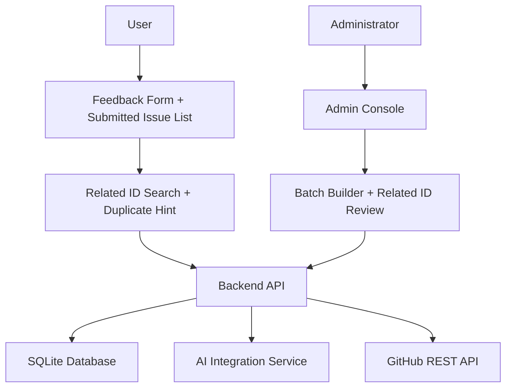

# Issue Aggregator MVP

Feature Name: issue-aggregator-mvp
Updated: 2026-06-11

## Description

该 MVP 用于收集社区反馈、在前端展示最近已提交的 GitHub Issue、让用户使用统一 `related_id` 标识问题域、由管理员选取相关反馈组成一个批次、调用 AI 生成结构化 Issue Draft、人工审核编辑后提交到 GitHub。

该设计聚焦最小闭环，核心价值在于减少碎片反馈带来的人工整理成本，同时保留人工把关和审计轨迹。

## Architecture



系统包含四个核心部分：

- 用户提交界面：接收原始反馈、展示已提交 Issue、提示重复主题。
- 管理后台：查看反馈、勾选批次、生成 Draft、审核并提交。
- 后端 API：统一处理存储、AI 调用、GitHub 提交、状态变更。
- SQLite：保存反馈、批次、Draft 和提交结果。

## Components and Interfaces

### 1. User Submission Page

- 表单字段：`type`、`related_id`、`raw_content`。
- 页面同时展示最近已提交的 GitHub Issue 列表。
- 页面支持按 `related_id`、类型、关键词筛选已提交 Issue。
- 当用户输入 `related_id` 时，页面即时显示同 `related_id` 的历史 Issue。
- 接口：`GET /api/issues/submitted`、`GET /api/issues/submitted/search`、`POST /api/feedback`。
- 成功后返回提交确认信息。
- 如果前端发现相同 `related_id` 的已提交 Issue，前端展示提示信息并保留 GitHub Issue 跳转入口。

`related_id` 规则：

- 使用小写字母、数字和短横线。
- 用于表达稳定的问题主题或功能主题。
- 示例：`editor-copy-button`、`login-oauth-flow`。

### 2. Admin Console

- 页面 1：反馈列表与批次选择。
- 页面 2：Draft 预览与编辑。
- 页面 3：提交结果查看。

关键交互：

- 选中反馈时显示 `related_id` 分布。
- 混合 `related_id` 建批次时弹出确认提示。
- 审核 Draft 时显示相同 `related_id` 的历史已提交 Issue。

核心操作：

- `GET /api/feedback?status=pending`
- `GET /api/issues/submitted`
- `GET /api/issues/submitted/search?related_id=...`
- `POST /api/draft-batches`
- `POST /api/draft-batches/{id}/integrate`
- `GET /api/drafts/{id}`
- `PUT /api/drafts/{id}`
- `POST /api/drafts/{id}/submit`

### 3. Backend API

推荐实现：FastAPI。

职责：

- 参数校验。
- SQLite 持久化。
- 查询已提交 Issue 列表。
- 执行 `related_id` 搜索与重复提示。
- 调用 AI 生成 Markdown Draft。
- 调用 GitHub REST API 创建 Issue。
- 写入状态流转与错误日志。

### 4. AI Integration Service

输入：一个 Draft Batch 中的所有 Feedback Item。

输出：

- `title`
- `body_markdown`
- `missing_info_flags`
- `related_id_summary`

建议 Prompt 约束：

- 固定输出英文 Issue。
- 固定包含 `Summary`、`Related ID`、`User Signals Count`、`Background`、`Steps to Reproduce`、`Expected Behavior`、`Actual Behavior`、`Impact`、`Missing Information`。
- 识别相同主题的反馈共性和新增信息。
- 如存在相同 `related_id` 的历史 Issue，输出本次新增信息摘要。
- 信息不足时输出明确占位符。

### 5. GitHub Submission Service

输入：审核通过的 Draft。

输出：

- `issue_number`
- `issue_url`
- `related_id`
- `submitted_at`
- `response_status`

提交正文模板：

```text
Summary
Related ID
User Signals Count
Background
Steps to Reproduce
Expected Behavior
Actual Behavior
Impact
Missing Information
```

## Data Models

### feedback_items

- `id`: UUID
- `type`: `bug | feature | enhancement | question`
- `related_id`: TEXT
- `expected_behavior`: TEXT nullable
- `actual_behavior`: TEXT nullable
- `raw_content`: TEXT
- `status`: `pending | grouped | submitted`
- `created_at`: DATETIME
- `submitted_at`: DATETIME nullable

### draft_batches

- `id`: UUID
- `status`: `created | integrating | draft_ready | approved | submitted | failed`
- `primary_related_id`: TEXT nullable
- `related_id_count`: INTEGER
- `created_at`: DATETIME
- `updated_at`: DATETIME
- `integration_error`: TEXT nullable

### draft_batch_items

- `id`: UUID
- `batch_id`: UUID
- `feedback_item_id`: UUID

### drafts

- `id`: UUID
- `batch_id`: UUID
- `title`: TEXT
- `body_markdown`: TEXT
- `related_id_summary`: TEXT
- `status`: `draft_ready | approved | submitted | failed`
- `ai_model`: TEXT nullable
- `prompt_snapshot`: TEXT nullable
- `updated_at`: DATETIME

### submissions

- `id`: UUID
- `draft_id`: UUID
- `github_issue_number`: INTEGER
- `github_issue_url`: TEXT
- `related_id`: TEXT
- `github_state`: TEXT nullable
- `labels_snapshot`: TEXT nullable
- `response_status`: INTEGER
- `submitted_at`: DATETIME
- `error_summary`: TEXT nullable

## Correctness Properties

- 一个 Feedback Item 在同一时间只属于一个未完成的 Draft Batch。
- 一个 Draft Batch 只对应一个当前有效 Draft。
- 一个已提交 Draft 只产生一次成功的 GitHub Issue 创建记录。
- GitHub 提交成功后，关联 Feedback Item 与 Draft Batch 状态必须同步为 `submitted`。
- 已提交 Issue 列表必须可以按 `related_id` 查询和展示。
- 相同 `related_id` 的已提交 Issue 必须可被前端即时提示。
- 混合 `related_id` 的 Draft Batch 必须经过管理员显式确认。
- 所有失败场景必须保留原始反馈与 Draft 内容，便于重试与审查。

## Error Handling

- 用户提交空内容：返回 400 和字段校验提示。
- 用户未填写 `related_id`：返回 400 和字段校验提示。
- 用户提交非法格式 `related_id`：返回 400 和格式校验提示。
- 批次为空：返回 400 和批次选择错误提示。
- 批次含多个 `related_id`：返回管理员确认提示或等待确认状态。
- AI 调用失败：记录 `failed` 状态和错误摘要，允许管理员重试。
- GitHub 提交失败：保留 `approved` Draft 内容，记录失败信息，允许再次提交。
- Token 缺失：返回 500，并在服务端日志中记录配置错误。
- SQLite 写入失败：返回 500，并保留请求上下文日志。

## Test Strategy

- 单元测试：
  - 反馈提交校验。
  - `related_id` 必填校验。
  - `related_id` 格式校验。
  - 已提交 Issue 列表查询。
  - 已提交 Issue 搜索与排序。
  - 重复 `related_id` 提示逻辑。
  - Draft Batch 创建规则。
  - 混合 `related_id` 批次确认规则。
  - 状态流转校验。
  - GitHub 提交结果写回。
- 集成测试：
  - `GET /api/issues/submitted` 返回已提交 Issue 列表。
  - `GET /api/issues/submitted/search` 返回匹配 `related_id` 的 Issue 列表。
  - `POST /api/feedback` 到 SQLite 落库。
  - 批次整合调用 AI mock。
  - Draft 审核并提交 GitHub mock。
- 手工验收：
  - 前端展示最近已提交 Issue 列表。
  - 前端按 `related_id`、类型、关键词搜索历史 Issue。
  - 用户提交三条相关反馈。
  - 用户输入 `related_id` 时可以对照已提交 Issue 判断是否重复。
  - 用户输入重复 `related_id` 时收到明确提示。
  - 管理员勾选三条反馈并生成 Draft。
  - 管理员选择混合 `related_id` 的反馈时看到确认提示。
  - 管理员编辑 Draft 后提交。
  - 系统显示 GitHub issue 编号和链接。

## Delivery Plan

1. 实现 FastAPI 服务骨架与 SQLite schema。
2. 实现反馈提交接口与基础用户页面。
3. 实现管理员反馈列表和批次创建。
4. 接入 AI Draft 生成与 Draft 编辑。
5. 接入 GitHub Issue 提交与结果回写。
6. 补齐测试与基础部署文档。
