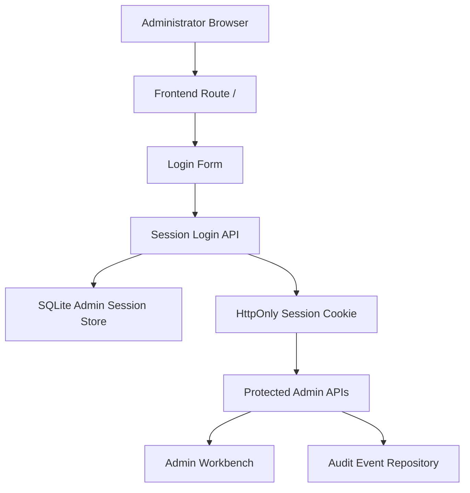

# Admin Access Hardening

Feature Name: admin-access-hardening
Updated: 2026-06-15

## Description

本设计为 Issue Aggregator 后台提供一轮独立的安全升级。升级目标有两部分：第一，把现有共享 `X-Admin-Token` 模式收敛为管理员账号密码登录和服务端会话；第二，把固定 `/admin` 前端路由与固定 `workbench` API 命名空间升级为环境配置驱动的随机路径片段。

这次设计保持现有单管理员工作流、SQLite 存储、FastAPI 路由组织和 Vue 单页应用结构。系统将继续使用现有审计事件模型，并在登录、登出、会话失效和登录冷却场景中补齐新的事件记录。后台路由随机化承担入口降噪职责，认证、会话、限流和审计承担核心访问控制职责。

## Architecture

### Flow Summary

1. 浏览器访问 `/<admin-route-slug>`。
2. 前端先调用会话查询接口判断当前是否已有有效后台登录态。
3. 未登录时展示账号密码表单；已登录时直接加载工作台数据。
4. 登录成功后，后端创建会话记录，签发 `HttpOnly` Cookie。
5. 受保护后台接口通过 Cookie 识别管理员会话，并继续沿用现有业务服务。
6. 登录失败、冷却命中、登出、会话过期和后台操作继续写入审计仓储。

## Components and Interfaces

### 1. Backend Session Auth Module

新增后端认证模块，负责管理员账号校验、密码摘要比对、会话创建、会话读取、会话撤销和登录限流。

建议新增配置项：

- `ADMIN_USERNAME`
- `ADMIN_PASSWORD_HASH`
- `ADMIN_SESSION_SECRET`
- `ADMIN_SESSION_COOKIE_NAME`
- `ADMIN_SESSION_IDLE_MINUTES`
- `ADMIN_SESSION_MAX_HOURS`
- `ADMIN_LOGIN_FAILURE_LIMIT`
- `ADMIN_LOGIN_FAILURE_WINDOW_MINUTES`
- `ADMIN_LOGIN_COOLDOWN_MINUTES`
- `ADMIN_ROUTE_SLUG`
- `ADMIN_API_NAMESPACE`

密码摘要建议采用 `argon2id`。服务端只保存摘要值，不保存明文密码。Cookie 建议带 `HttpOnly`、`Secure`、`SameSite=Strict`、`Path=/api/admin/<namespace>` 或全局后台相关路径策略。

### 2. Admin Session APIs

建议新增接口：

- `POST /api/admin/<namespace>/session/login`
  - 输入：`username`、`password`
  - 输出：管理员展示摘要、当前会话过期信息
  - 副作用：创建会话记录、设置 Cookie、写登录成功或失败审计
- `GET /api/admin/<namespace>/session/me`
  - 输入：Session Cookie
  - 输出：当前登录态、管理员展示摘要、会话过期信息
- `POST /api/admin/<namespace>/session/logout`
  - 输入：Session Cookie
  - 输出：成功信号
  - 副作用：撤销会话记录、清空 Cookie、写登出审计

现有后台业务接口保持语义不变，只把 `require_admin_token` 替换为 `require_admin_session`。

### 3. Session Repository

建议新增 `admin_sessions` 表和 `admin_login_attempts` 表。

`admin_sessions` 用于保存：

- `id`
- `session_token_hash`
- `username`
- `client_ip`
- `user_agent_summary`
- `created_at`
- `last_seen_at`
- `idle_expires_at`
- `absolute_expires_at`
- `revoked_at`

`admin_login_attempts` 用于保存：

- `id`
- `username`
- `client_ip`
- `result`
- `reason`
- `created_at`

Cookie 内保存随机原始 session token，数据库保存 token 哈希值。服务端通过哈希查找会话，降低数据库泄露时的直接利用风险。

### 4. Frontend Admin Access Flow

前端路由从固定 `/admin` 改为基于构建期变量的 `/<admin-route-slug>`。建议引入：

- `VITE_ADMIN_ROUTE_SLUG`
- `VITE_ADMIN_API_NAMESPACE`

前端改造点：

- `router/index.ts` 使用动态 slug 注册后台页面路由。
- `services/api.ts` 删除 `sessionStorage.issueAggregatorAdminToken` 读写逻辑。
- 所有后台 API 请求改为 `fetch(..., { credentials: 'include' })`。
- `AdminWorkbenchPage.vue` 首屏先请求 `session/me`，基于返回结果决定显示登录页还是工作台。
- 登录页从输入 token 改为输入用户名和密码。

### 5. Random Route Strategy

后台前端路由和后台 API 命名空间继续分离配置：

- 前端入口：`/<ADMIN_ROUTE_SLUG>`
- API 前缀：`/api/admin/<ADMIN_API_NAMESPACE>`

这样可以避免把前端路径和 API 命名空间耦合成同一字符串，便于前端页面路径调整和 API 路由滚动更新。建议 slug 规则为 `24` 到 `32` 位小写字母数字短串，启动时校验格式。

## Data Models

### admin_sessions

- `id`: UUID
- `session_token_hash`: TEXT unique
- `username`: TEXT
- `client_ip`: TEXT nullable
- `user_agent_summary`: TEXT nullable
- `created_at`: DATETIME
- `last_seen_at`: DATETIME
- `idle_expires_at`: DATETIME
- `absolute_expires_at`: DATETIME
- `revoked_at`: DATETIME nullable

### admin_login_attempts

- `id`: UUID
- `username`: TEXT
- `client_ip`: TEXT nullable
- `result`: `success | failure | cooldown_blocked`
- `reason`: TEXT
- `created_at`: DATETIME

### settings additions

- `admin_route_slug`: TEXT
- `admin_username`: TEXT
- `admin_password_hash`: TEXT
- `admin_session_secret`: TEXT
- `admin_session_cookie_name`: TEXT
- `admin_session_idle_minutes`: INTEGER
- `admin_session_max_hours`: INTEGER
- `admin_login_failure_limit`: INTEGER
- `admin_login_failure_window_minutes`: INTEGER
- `admin_login_cooldown_minutes`: INTEGER

## Correctness Properties

- 每个受保护后台请求都必须通过有效会话校验后才能进入业务处理。
- 每个会话同时满足空闲过期时间和绝对过期时间约束。
- 每个会话 token 原文只出现在浏览器 Cookie 中，数据库只保存 token 哈希。
- 每次登录成功必须产生一条可追踪会话记录。
- 每次登录失败、冷却命中、会话失效和登出都必须留下审计痕迹。
- 公开反馈接口与公开已提交 Issue 查询继续保持匿名可访问。
- 后台前端路径与后台 API 命名空间都来源于显式环境配置。

## Error Handling

### Authentication Failures

- 用户名不存在、密码错误、会话缺失、会话过期、会话已撤销统一返回认证失败响应。
- 登录冷却命中返回可识别的错误码，例如 `ADMIN_LOGIN_COOLDOWN_ACTIVE`。
- 后台前端收到认证失败后清空本地解锁状态并回到登录页。

### Configuration Failures

- 生产环境启动时校验 `ADMIN_ROUTE_SLUG`、`ADMIN_API_NAMESPACE`、`ADMIN_USERNAME`、`ADMIN_PASSWORD_HASH`、`ADMIN_SESSION_SECRET`。
- 关键配置缺失或格式非法时直接启动失败。

### Session State Failures

- 会话校验失败时不返回具体命中原因给前端页面，只返回统一认证状态和错误码。
- 会话刷新逻辑如果采用滑动续期，续期失败时保留当前请求的认证失败路径和审计记录。

## Migration Plan

### Phase 1: Dual-Path Preparation

- 增加新配置读取和格式校验。
- 新建 `admin_sessions` 与 `admin_login_attempts` 表。
- 保留现有 `ADMIN_API_NAMESPACE` 能力，并新增 `ADMIN_ROUTE_SLUG`。
- 增加登录、会话查询、登出接口。

### Phase 2: Frontend Cutover

- 前端路由切到 `VITE_ADMIN_ROUTE_SLUG`。
- 后台登录页替换 token 输入框。
- `services/api.ts` 切换到 Cookie 会话模式。
- 工作台初始化改为先探测 `session/me`。

### Phase 3: Token Retirement

- 删除 `ADMIN_API_TOKEN` 配置读取。
- 删除 `X-Admin-Token` 请求头依赖和相关前端存储逻辑。
- 保留原有 `admin_auth_failed` 与 `admin_action_succeeded` 审计类别，并按需要补充 `admin_auth_succeeded`、`admin_session_revoked`。

## Test Strategy

### Backend Tests

- 单元测试覆盖密码摘要校验、会话创建、会话过期、会话撤销、登录失败计数、冷却命中。
- 接口测试覆盖 `session/login`、`session/me`、`session/logout`。
- 回归测试覆盖现有后台业务接口在有效会话下可继续使用。
- 配置测试覆盖生产环境关键配置缺失时启动失败。

### Frontend Tests

- 组件测试覆盖后台首屏会话探测、登录成功、登录失败、登出、会话失效回退。
- API helper 测试覆盖 `credentials: 'include'`、不再携带 `X-Admin-Token`。
- 路由测试覆盖后台页面注册到动态 slug。

### End-to-End Checks

- 登录后进入工作台并完成一次批次创建。
- 关闭浏览器标签页后重新访问后台路径，验证有效会话恢复。
- 手工使会话过期后刷新后台页，验证回到登录页。
- 连续触发错误密码直到命中冷却，验证审计和错误提示。

## References

[^1]: [backend/app/config.py](/workspace/backend/app/config.py:41)
[^2]: [backend/app/routers/feedback.py](/workspace/backend/app/routers/feedback.py:89)
[^3]: [frontend/src/router/index.ts](/workspace/frontend/src/router/index.ts:6)
[^4]: [frontend/src/services/api.ts](/workspace/frontend/src/services/api.ts:110)
